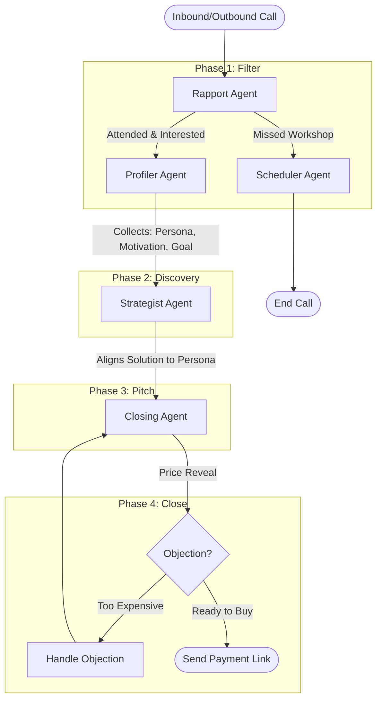

# Olive LiveKit Multi-Agent Demo

A state-of-the-art **Multi-Agent Voice System** built with [LiveKit Agents](https://docs.livekit.io/agents). 

This project demonstrates how to build a complex sales AI that feels like a single, cohesive persona ("Rohan") while switching between specialized underlying logic models ("Agents") for different phases of the conversation.

## 🚀 Quick Start

### 1. Prerequisites
- Python 3.10+
- LiveKit Cloud Account

### 2. Environment Setup
**(Note: OpenAI, Deepgram, and Cartesia keys are optional unless you want to use your own keys. By default, the demo may rely on pre-configured secrets if available, but for a fresh clone you must provide these.)**

Create a `.env` file:
```bash
LIVEKIT_URL=wss://...
LIVEKIT_API_KEY=...
LIVEKIT_API_SECRET=...
OPENAI_API_KEY=sk-...         # Required for logic (LLM)
DEEPGRAM_API_KEY=...          # Required for Transcriptions (STT)
CARTESIA_API_KEY=...          # Required for Voice (TTS)
```

### 3. Run the Agent
Start the worker process (the brain):
```bash
python src/main.py dev
```

### 4. Trigger a Call
To test the flow, use the included trigger script. 
**Example (using your SIP ID):**
```bash
python src/trigger_call.py +919672619061 ST_8DQKuWuMCxbQ
```
*(Replace `+91...` with your actual phone number to receive the call.)*

---

## 🧠 System Architecture

The system uses a **Handoff Pattern** where specialized agents take turns controlling the conversation, but they all share a single memory (`SalesContext`).

### The Agents
1.  **Rapport Agent** (`rapport.py`)
    *   **Role:** The Greeter.
    *   **Goal:** Confirm identity, build initial trust, and verify workshop attendance.
    *   **Transition:** If user engages -> Handoff to **Profiler**. If user missed workshop -> Handoff to **Scheduler**.
2.  **Scheduler Agent** (`scheduler.py`)
    *   **Role:** The Rescuer.
    *   **Goal:** Re-book users who missed the workshop.
    *   **State:** Terminal (Ends call after booking).
3.  **Profiler Agent** (`profiler.py`)
    *   **Role:** The Researcher.
    *   **Goal:** Identify the user's **Persona** (Student, Professional, etc.) and **Motivation**.
    *   **Stealth Handoff:** Once 3 key data points are collected, it *silently* passes the context to the Strategist.
4.  **Strategist Agent** (`strategist.py`)
    *   **Role:** The Consultant.
    *   **Goal:** Pitch the product using a specific angle tailored to the Persona found by the Profiler.
    *   **Transition:** If user agrees to the logic -> Handoff to **Closing**.
5.  **Closing Agent** (`closing.py`)
    *   **Role:** The Closer.
    *   **Goal:** Discuss price, handle objections (Money, Time), and send payment links.

### How They Interact (The "Stealth Handoff")
To the user, this feels like one continuous conversation. Under the hood:
1.  Agent A calls a **Function Tool** (e.g., `handoff_to_profiler`).
2.  The tool returns a **New Agent Instance** (e.g., `ProfilerAgent()`).
3.  The **SalesContext** (contains name, history, answers) is passed to the new agent.
4.  **Lifecycle Hook**: We use `async def on_enter(self)` to force the new agent to generate speech *immediately*, preventing awkward silence.

### Logic Flowchart



## 🛠️ Key Technical Patterns implemented
-   **Context Injection**: How we pass `workshop_topic` and `lead_name` into the system prompt.
-   **Session Injection**: How we give agents access to the `session` to trigger `generate_reply()`.
-   **Transcript Logging**: How we track `active_agent` to ensure the full conversation history is saved to `.txt` files properly.
